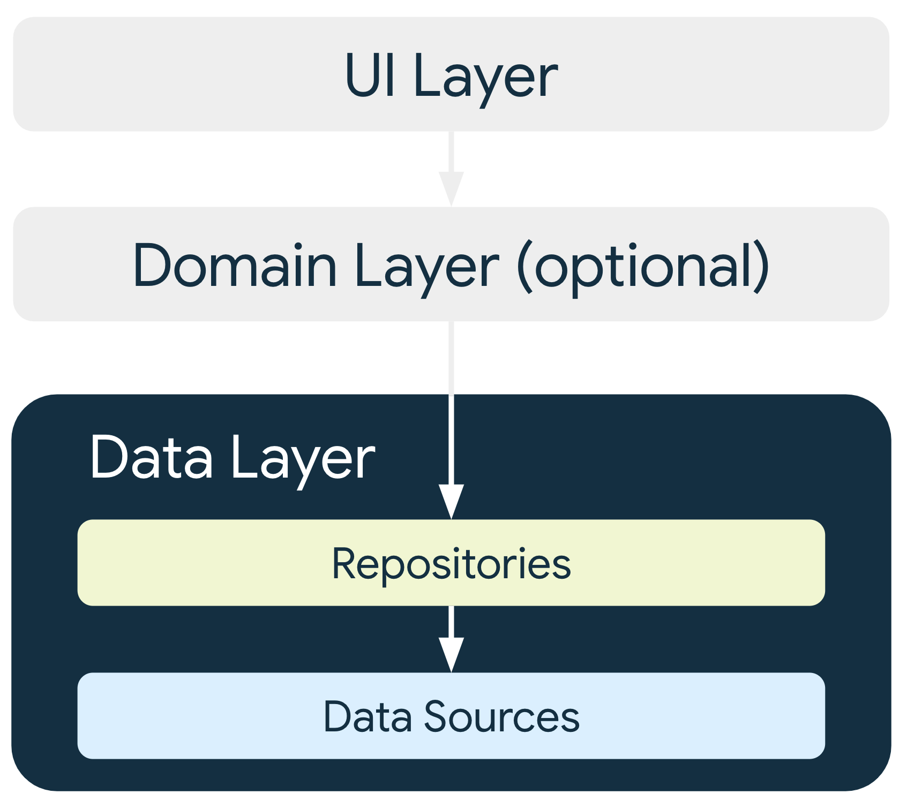

# 앱 아키텍처

- [앱 아키텍처](#앱-아키텍처)
  - [관심사 분리](#관심사-분리)
  - [데이터 모델에서 UI 도출하기](#데이터-모델에서-ui-도출하기)
  - [단일 소스 저장소](#단일-소스-저장소)
  - [단방향 데이터 흐름](#단방향-데이터-흐름)
  - [권장 앱 아키텍처](#권장-앱-아키텍처)
    - [최신 앱 아키텍처](#최신-앱-아키텍처)
    - [UI Layer](#ui-layer)
    - [Data Layer](#data-layer)
    - [Domain Layer](#domain-layer)
    - [구성요소 간 종속 항목 관리](#구성요소-간-종속-항목-관리)
  - [일반 권장사항](#일반-권장사항)
  - [아키텍처의 이점](#아키텍처의-이점)
  - [레퍼런스](#레퍼런스)
  
---

앱 아키텍처는 앱 설계도를 말하며, 앱을 강력하고 테스트 및 유지관리가 가능하도록 만들게 도와줍니다.

## 관심사 분리

**가장 중요한 원칙**이다.  
View(Activity 또는 Fragment 등)에 모든 코드를 작성하지 않는다.
UI나 OS 상호작용을 처리하는 코드만 포함해야 한다.  
최대한 가볍게 유지해야 하고 LifeCycle과 관련된 많은 문제를 주의해야 한다.  
의존성을 **최소화** 하자

## 데이터 모델에서 UI 도출하기

또 다른 중요한 원칙중 하나  
가급적 지속적인 데이터 모델을 권장한다.  
앱의 UI 요소 및 기타 구성요소로부터 독립된 모델이다.  
UI 및 앱 구성요소 수명 주기와는 관련이 없음
이러한 모델로 인해 네트워크가 없어도 앱이 계속 작동하며, 앱의 테스트 가능성과 견고성이 더 높아진다.

## 단일 소스 저장소

새로운 데이터 유형을 정의할 때는 단일 소스 저장소(SSOT, Single Source Of Truth)를 할당해야 한다.  
SSOT는 데이터의 소유자이며, SSOT만 데이터를 수정하거나 변경할 수 있다.  
이를 위해 불변 유형을 사용하여 데이터를 노출하며, 다른 유형이 호출할 수 있는 이벤트를 수신하거나 함수를 노출하여 데이터를 수정한다.  
이로 인해 특정 유형 데이터의 모든 변경사항을 한 곳으로 일원화할 수 있으며,  
다른 유형이 조작할 수 없도록 데이터를 보호하고,  
데이터 변경사항을 더 쉽게 추적하여 버그를 발견하기가 쉬워진다.

## 단방향 데이터 흐름

단일 소스 저장소 원칙은 종종 단방향 데이터 흐름(UDF, UniDirectional Data Flow)패턴과 함께 사용된다.  
UDF에서 **상태**는 한 방향으로만 흐른다.  
데이터를 수정하는 **이벤트**는 반대방향으로 흐른다.
상태 또는 데이터는 계층 구조의 상위 범위 유형 → 하위 범위 유형 으로 흐른다.  
이벤트는 하위 범위 유형에서 트리거되어 상응하는 데이터 유형의 SSOT에 도달한다.  
예를 들어 앱 데이터는 보통 데이터 소스 → UI 로 흐른다.  
버튼 누르기와 같은 사용자 이벤트는 UI → SSOT로 흐르며, SSOT에서는 앱 데이터가 불변 유형으로 수정 및 노출된다.  
이로 인해 데이터 일관성을 강화하고, 오류가 발생할 확률을 줄여 주며, 디버그하기 쉽고, SSOT의 모든 장점을 제공한다.

## 권장 앱 아키텍처

구글에서 권장하는 앱 설계 방법
위에서 말한 일반적인 아키텍처 원칙에 따라 *최소한* 두 가지 레이어가 포함되어야 한다.

- UI Layer : 화면에 앱 데이터를 표시
- Data Layer : 앱의 비즈니스 로직을 포함하고 앱 데이터를 노출함
- (선택사항) Domain Layer : 비즈니스 로직의 캡슐화로 재사용성을 높임

### 최신 앱 아키텍처

최신 앱 아키텍처에서는 다음 기법을 사용하는 것을 권장함

- 반응형 및 계층형 아키텍처
- 앱의 모든 레이어에서의 단방향 데이터 흐름(UDF)
- 상태 홀더가 있는 UI 레이어로 UI의 복잡성 관리
- Coroutine 및 Flow
- 종속 항목 삽입 권장사항

더 자세한 내용은 [Android 아키텍처 권장사항](https://developer.android.com/topic/architecture/recommendations?hl=ko)

### [UI Layer](Ui-Layer/Ui-Layer-230919.md)

UI 레이어(프레젠테이션 레이어 라고도 함)의 역할은 화면에 앱 데이터를 표시.
사용자 상호작용(버튼 누르기 등) 또는 외부 입력(네트워크 응답 등)으로 인해 데이터가 변할 때마다 변경사항을 반영하도록 UI가 업데이트 되어야 함

UI 레이어는 다음 두가지로 구성 됨

- 화면에 데이터를 렌더링하는 UI 요소.  
View 또는 Jetpack Compose 함수를 사용하여 빌드
- 데이터를 보유하고 이를 UI에 노출하며 로직을 처리하는 상태 홀더  
예 : ViewModel 클래스

### Data Layer

데이터 레이어는 *비즈니스 로직*이 포함됨. 비즈니스 로직은 앱에 가치를 부여하는 요소로, 앱의 데이터 생성, 저장, 변경 방식을 결정하는 규칙으로 구성 됨.  
데이터 레이어는 0개부터 여러 개의 데이터 소스를 각각 포함할 수 있는 *저장소*로 구성 됨.  
앱에서 처리하는 다양한 유형의 데이터별로 저장소 클래스(Repository)를 만들어야 함.

다음은 Repository 에서 담당하는 작업

- 앱의 나머지 부분에 데이터 노출
- 데이터 변경사항을 한 곳에 집중
- 여러 데이터 소스 간의 충돌 해결
- 앱의 나머지 부분에서 데이터 소스 추상화
- 비즈니스 로직 포함

각 데이터 소스 클래스는 파일, 네트워크 소스, 로컬 데이터베이스와 같은 하나의 데이터 소스만 사용해야 함. 데이터 소스 클래스는 데이터 작업을 위해 애플리케이션과 시슽메 간의 가교 역할을 함.

### Domain Layer

도메인 레이어는 UI 레이어와 데이터 레이어 사이에 있는 선택적 레이어.  
도메인 레이어는 복잡한 비즈니스 로직이나 여러 ViewModel에서 재사용되는 간단한 비즈니스 로직의 캡슐화를 담당.  
모든 앱에 도메인 레이어가 있는 것이 아님. 선택사항임. 복잡성을 처리하거나 재사용성을 선호하는 등 필요한 경우에만 사용

이 레이어의 클래스는 일반적으로 *사용 사례(UseCases)* 또는 *상호작용자(Interactors)* 라고 함. 각 사용 사례는 *하나의 기능*을 담당해야 함.

### 구성요소 간 종속 항목 관리

앱의 클래스는 올바른 작동을 위해 다른 클래스에 종속 됨. 특정 클래스의 종속 항목을 수집하는 데 다음 디자인 패턴 중 하나를 사용할 수 있음

- 의존성 주입(DI, Dependency Injection) : 종속 항목 주입이라고도 함. 이를 사용하면 클래스가 자신의 종속 항목을 구성할 필요 업싱 종속 항목을 정의할 수 있음. 런타임 시 다른 클래스가 이 종속 항목을 제공해야 함.
- 서비스 로케이터 : 서비스 로케이터 패턴은 클래스가 자신의 종속 항목을 구성하는 대신 종속 항목을 가져올 수 있는 레지스트리를 제공함.

이 패턴은 코드를 중복하거나 복잡성을 추가하지 않아도 종속 항목을 관리하기 위한 명확한 패턴을 제공하므로 코드를 확장할 수 있음.  
이러한 패턴을 사용하면 테스틑와 프로덕션 구현 간에 신속하게 전환이 가능

의존성 주입 패턴을 따르려면 Hilt 라이브러리 사용을 권장.  
Hilt는 종속 항목 트리를 따라 이동하여 객체를 자동으로 구성하고 종속 항목의 컴파일 시간을 보장하며 Android 프레임 워크 클래스의 종속 항목 컨테이너를 만듦.

## 일반 권장사항

다음 권장사항은 필수는 아니지만, 대부분의 경우 장기적으로 더 강력하고 테스트 및 유지관리가 쉬운 코드베이스를 만드는 데 도움이 됨.

- 앱 구성 요소에 데이터를 저장  
Activity, Service, broadcast receiver와 같은 앱의 진입점을 데이터 소스로 지정 지양. 대신에 그 진입점과 관련된 데이터 일부만 가져오도록 다른 구성 요소에 맞춰 조정 권장.  
각 앱 구성 요소는 사용자와 기기의 상호작용 및 시스템의 전반적인 현재 상태에 따라 단기간만 지속되기 때문임.

- Android 클래스의 종속 항목을 최소화  
앱 구성요소는 `Context` 또는 `Toast` 같은 Android 프레임워크 SDK API 를 사용하는 유일한 클래스여야 함. 앱 구성요소와 별도로 앱의 다른 클래스를 추상화하면 테스트 가능성을 높이고 앱 내의 결합도를 줄일 수 있음.

- 앱의 다양한 모듈 간 책임 잘 정의된 경계를 만듦  
예로 네트워크에서 데이터를 로드하는 코드를 코드베이스의 여러 클래스나 패키지 전체에 분산하면 안 됨. 마찬가지로 데이터 캐시와 데이터 결합 등 여러 개의 관련 없는 책임을 동일한 클래스에 정의하면 안 됨.

- 각 모듈에서 가능하면 적게 노출  
예로 모듈의 내부 구현 세부정보를 노출하는 단축키를 만들어서는 안 됨.  
단기적으로는 약간의 시간을 벌 수 있지만, 코드베이스가 발전함에 따라 기술적 문제가 여러 번 발생할 수 있음

- 다른 앱과 차별되도록 앱의 고유한 핵심에 초점을 맞춤  
동일한 상용구 코드를 반복하여 작성하느라 시간 낭비 지양. 대신 앱을 독특하게 만드는 데 시간과 에너지를 집중하고 반복적인 상용구는 Jetpack 라이브러리와 기타 권장 라이브러리가 처리하도록 권장.

- 앱의 각 부분을 독립적으로 테스트하는 방법을 고려한다.  
예로 네트워크에서 데이터를 가져오기 위해 API를 잘 정의하면 해당 데이터를 로컬 데이터베이스에 보존하는 모듈을 더 쉽게 테스트할 수 있음.  
그러지 않고 두 모듈의 로직을 한 위치에 혼합하거나, 네트워크 코드를 전체 코드베이스에 분산하면 테스트가 불가능하지는 않을지라도 훨씬 더 어려워짐

- 유형은 동시 실행 정책을 담당  
장기 실행 차단 작업을 실행하는 유형은 이 계산을 올바른 쓰레드로 옮기는 일을 담당함.  
이 유형은 자신이 실행하는 컴퓨팅 유형이 무엇이고 어느 쓰레드에서 실행되어야 하는지를 알고 있음. 유형은 기본 안전성을 갖춰야 함.  
즉, 기본 쓰레드에서 차단 없이 안전하게 호출될 수 있어야 함.

- 가능한 한 관련성이 높은 최신 데이터를 보존  
이렇게 하면 기기가 오프라인 모드일 때도 사용자가 앱의 기능을 이용할 수 있음. 모든 사용자가 끊김 없고 속도가 빠른 연결을 사용하지 않음에 유의. 수신 상태가 좋지 않을 수 있음.

## 아키텍처의 이점

위와 같이 권장하는 지침을 따르게 된다면 많은 이점이 있음

- 앱의 전반적인 유지관리성, 품질, 견고성이 개선 됨
- 앱을 확장할 수 있음. 코드 충돌이 최소화되어 더 많은 인력과 팀이 동일한 코드베이스에 기여 가능
- 온보딩에 도움이 됨. 아키텍처는 프로젝트에 일관성을 부여하므로 새로운 팀원이 빠르게 업무를 시작하고 보다 짧은 시간에 효율을 높일 수 있음
- 테스트하기가 더 쉬워짐. 좋은 아키텍처는 테스트하기가 더 쉬운 간단한 유형을 사용하도록 지원함.
- 잘 정의된 프로세스를 사용하여 버그를 체계적으로 조사 가능

아키텍처에 투자하면 사용자에게도 직접적인 영향을 줌. 개발자의 생산성이 높아짐에 따라 앱의 안정성이 향상되고 더 많은 기능이 적용됨.  
하지만 아키텍처에는 초기에 투자하는 시간이 필요함.

---

> MVVM 과 클린 아키텍처에 대해서 알아보다 안드로이드를 만든 구글에서는 어떤 아키텍처를 사용하면 좋을지 알게됐다. 설계는 역시 상당히 추상적이고 적용하는 앱마다 기능과 구조가 모두 다르니 이해하고 실제 앱에서 적용하기에는 많은 시간을 쏟아야 했다. 하지만 시간을 부은 만큼 앱에 적용하고 나면 확장성과 코드 가독성이 상당히 좋아졌다는 게 체감이 된다. 또 유닛 테스트, UI 테스트, TDD, DI 등 아직 제대로 접해보지 못한 기술들에 대해서도 관심이 가게 된다.
>
> 구글에서는 클린 아키텍처에 설계를 지향하는 것 같다. 위에서 말한 각 레이어가 클린 아키텍처의 프리젠테이션, 도메인, 데이터 레이어에 각각 해당하고 입력 및 변화가 한 방향으로만 흐른다는 것 등이 일치하다는 것을 알 수 있었다.
> 구글의 아키텍처 가이드 뿐만 아니라 로버트 C. 마틴의 클린 아키텍처 개발 방법론 자체도 틈틈히 공부해야 겠다. 안드로이드 뿐만 아니라 iOS 앱 개발에도 분명 도움이 될거다.
---

## 레퍼런스

<https://developer.android.com/topic/architecture?hl=ko>
