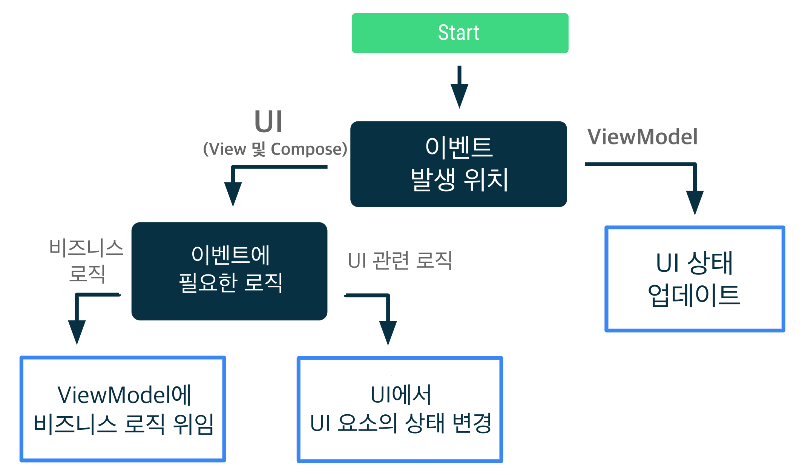

# UI 이벤트

UI 이벤트는 UI 레이어 또는 ViewModel 에서 처리해야 하는 작업. 가장 일반적인 이벤트 유형은 유저 이벤트.  
유저는 화면 클릭과 같은 앱과의 상호작요을 통해 유저 이벤트를 생성함.  
UI에서 `onClick()` 리스너와 같은 콜백을 통해 이러한 이벤트를 사용함

> UI : 유저 인터페이스 처리하는 View 및 Compose 코드를 말함
>
> UI 이벤트 : UI 레이어에서 처리해야하는 작업
>
> 유저 이벤트 : 유저가 앱과 상호작용할 때 생성하는 이벤트

ViewModel은 유저가 데이터를 새로고침 버튼을 클릭하는 경우 같이 일반적으로 특정 유저 이벤트의 비즈니스 로직을 처리함.  
ViewModel은 보통 UI에서 호출할 수 있는 함수를 노출하여 이러한 로직을 처리함.  
유저 이벤트에는 다른 화면으로 이동하거나 Snackbar 표시하는 등과 같은 UI에서 직접 처리할 수 있는 UI 동작 로직이 있을 수 있음.

비즈니스 로직은 다른 모바일 플랫폼 또는 폼팩터의 같은 앱에 동일하게 유지되는 반면 UI 동작 로직은 케이스에 따라 다를 수 있는 구현 세부정보임.
> 비즈니스 로직은 Android와 같은 OS, 플랫폼 에 종속되지 않는 코드등을 말함
>
> UI 동작 로직은 Android에 종속되어 있는 코드 등을 말함.

- 비즈니스 로직 : 결제 또는 사용자 환경설정 저장과 같은 상태 변경과 관련하여 필요한 조치를 말함.
- UI 동작 로직 및 UI 로직 : Navigation 로직 또는 사용자에게 메시지를 표시하는 방법과 같이 상태 변경사항을 표시하는 방법을 말함. 이 로직은 UI에서 처리함.

## UI 이벤트 결정 트리



위 다이어그램은 특정 이벤트 사용 사례를 처리하는 최상의 방법을 차기 위한 결정 트리임.  
이러한 접근 방식에 대하여 자세히 알아보자

---

## 사용자 이벤트 처리

확장 가능한 항목의 상태와 같이 UI 요소의 상태 수정과 관련된 경우 UI에서 사용자 이벤트를 직접 처리할 수 있음.  
이벤트가 화면상 데이터의 새로고침과 같은 비즈니스 로직을 실행해야 하는 경우 ViewModel로 처리해야 함.

아래 예제는 버튼을 사용하여 UI 요소를 확장하는 코드임.  
UI 로직은 UI에서 실행하고 데이터를 새로고침 하는 것은 비즈니스 레이어에서 실행하는 것을 볼 수 있음

```kotlin
class LatestNewsActivity: AppCompatActivity() {
    private lateinit var binding: ActivityLatestNewsBinding
    private val viewModel: LatestNewsViewModel by viewModels()

    override fun onCreate(savedInstanceState: Bundle?) {
        /* ... */

        // 확장 버튼을 누를시 그에 맞는 UI를 보여줌
        // View 내부, 즉 UI에서 UI 로직을 실행함
        binding. expandButton.setOnClickListener {
            binding.expandedSection.visibility = View.VISIBLE
        }

        // 새로고침 버튼을 누를시 데이터를 새로 가져옴
        // ViewModel, 즉 비즈니스 레이어에서 비즈니스 로직을 실행함
        binding.refreshButton.setOnClickListener {
            viewModel.refreshNews()
        }
    }
}
```

### RecyclerView의 사용자 이벤트

RecyclerView 항목 또는 맞춤 View와 같이 UI 트리 아래쪽에서 작업이 생성되는 경우에도 ViewModel이 사용자 이벤트를 처리해야 함.

예를 들어 NewsActivity의 모든 뉴스 항목에 북마크 버튼이 포함되어 있을 때  
ViewModel은 북마크된 뉴스 항목의 id 를 알아야 함. 유저가 뉴스 항목을 북마크에 추가하면 RecyclerView 어댑터는 ViewModel에 노출된 `addBookmark(newsId)` 함수를 호출하지 않고, 여기에 ViewModel의 종속 항목이 필요함.  
대신 ViewModel은 이벤트 처리를 위한 구현이 포함된 `NewsItemuiState`라는 상태 객체를 노출함.

```kotlin
data class NewsItemUiState(
    val title: String,
    val body: String,
    val bookmarked: Boolean = false,
    val publicationDate: String,
    val onBookmark: () -> Unit
)

class LatestNewsViewMdoel(
    private val formatDateUseCase: FormatDateUseCase,
    private val repository: NewsRepository
) : ViewModel() {
    val newsListUiItems = repository.latestNews.map { news ->
        NewsItemUiState(
            title = news.title,
            body = news.body,
            bookmarked = news.bookmarked,
            publicationDate = formatDateUseCase(news.publicationDate),
            // 북마크 버튼 클릭시 람다 함수로 전달된 비즈니스 로직을 실행함
            onBookmark = { repository.addBookmark(news.id) }
        )
    }
}
```

위와 같이 하면 RecyclerView 어댑터가 `NewsItemUiState` 객체 목록과 같이 필요한 데이터만 사용할 수 있음.  
어댑터가 전체 ViewModel에 엑세스 할 수 없으므로 ViewModel에 의해 노출된 기능을 악용할 가능성이 낮음.  
Acitivty 클래스에서만 ViewModel을 사용하도록 허용하는 경우 책임이 분리됨. 이러면 View 또는 RecyclerView 어댑터와 같은 UI별 객체가 ViedwModel과 직접 상호작용하지 않음.

> ⚠ 경고 : ViewModel을 RecyclerView 어댑터에 전달하면 이를 ViewModel 클래스와 긴밀하게 결합하게 되므로 좋지 지양할 것
>
> 참고 : 또 다른 일반적인 패턴은 RecyclerView 어댑터가 유저 작업을 위한 Callback 인터페이스를 갖는 것임. 이 경우 Activity 및 Fragment가 바인딩을 처리하고 Callback 인터페이스에서 직접 ViewModel 함수를 호출할 수 있음.

### 유저 이벤트 함수의 이름 지정 규칙

유저 이벤트를 처리하는 ViewModel 함수는 처리하는 작업에 따라 동사를 포함해 이름을 지정해야함  
예) `addBookmark(id)` 또는 `logIn(username, password)`

---

## ViewModel 이벤트 처리

**ViewModel에서 발생하는 UI 작업(ViewModel 이벤트)은 항상 UI 상태 업데이트로 이어짐.**  
이는 단방향 데이터 흐름(UDF)의 원칙을 준수하는 것. 따라서 구성 변경 후에 이벤트를 재현할 수 있으며, UI 작업이 손실되지 않음.  
저장된 상태 모듈(SavedStateHandle)을 이용하는 경우 선택적으로 프로세스 종료 후에도 이벤트를 재현 가능하게 만들 수 있음.

UI 작업을 UI 상태에 매핑하는 절차가 늘 간단하지 않지만, 그렇게 하면 로직은 더 간단해짐.  
예를 들어 사고 과정이 UI를 특정 화면으로 이동하는 방법을 결정하는 데서 끝나서는 안됨. UI 상태에서 사용자 흐름을 나타내는 방법을 좀 더 생각해봐야함.  
**즉, UI에서 실행해야 하는 작업이 아니라 이러한 작업이 UI 상태에 미치는 영향을 생각해 볼 것.**

예를 들어 사용자가 로그인 화면에 로그인 후 홈 화면으로 이동하는 경우를 들자면, 이 상황은 UI 상태에서 다음과 같이 모델링 할 수 있음

```kotlin
data class LoginUiState(
    val isLoading: Boolean = false,
    val errorMessage: String? = null,
    val isUserLoggedIn: Boolean = false
)
```

이 UI는 `isUserLoggedIn` 상태 변경에 반응하고 홈 화면으로 이동하는 등 올바른 대상으로 이동함.

```kotlin
class LoginViewModel: ViewModel() {
    private val _uiState = MutableStateFlow(LoginUiState())
    val uiState: StateFlow<LoginUiState> = _uiState.asStateFlow()
    /* ... */
}

class LoginActivity: AppCompatActivity() {
    private val viewModel: LoginViewModel by viewModels()

    override fun onCreate(savedInstanceState: Bundle?) {
        /* ... */

        lifecycleScope.launch {
            repeatOnLifecycle(Lifecycle.State.STARTED) {
                viewModel.uiState.collect { uiState ->
                    if (uiState.isUserLoggedIn) {
                        // 홈 화면으로 이동
                        navController.navigate(login_to_home)
                    }
                }
            }
        } 
    }
}
```

### 이벤트를 소비하면 상태 업데이트가 트리거 될 수 있음

UI에서 특정 ViewModel 이벤트를 소비하면 다른 UI 상태가 업데이트 될 수 있음.  
예를 들어 화면에 임시 메시지를 표시하여 사용자에게 무언가 발생했음을 알리는 경우, 메시지가 화면에 표시되었을 때 UI가 다른 상태 업데이트를 트리거하도록 ViewModel에 알려야 함.  
사용자가 메시지를 소비했을 때(메시지를 닫거나 시간이 지남) 발생하는 이벤트는 *사용자 입력* 으로 다루어야 할 수 있음으로 ViewModel에서 이를 알아야 함. 이 상황에서는 다음과 같이 UI 상태를 모델링 할 수 있음.

```kotlin
data class LatestNewsUiState(
    val news: List<News> = emptyList(),
    val isLoading: Boolean = false,
    val userMessage: String? = null
)
```

비즈니스 로직이 사용자에게 임시 메시지를 새로 표시해야 하는 경우 ViewModel은 다음과 같이 UI 상태를 업데이트 함.

```kotlin
class LatestNewsViewModel(/* ... */): ViewModel() {
    private val _uiState = MutableStateFLow(LatestNewsUiState(isLoading = true))
    val uiState: StateFlow<LatestNewsUiState> = _uiState.asStateFlow()

    fun refreshNews() {
        viewModelScope.launch {
            // 인터넷 연결이 없을 시 메시지를 화면에 띄움
            if (!internetConnection()) {
                _uiState.update { currentUiState ->
                    currentUiState.copy(userMessage = "인터넷 연결 없음")
                }
                return@launch
            }

            // else 컨디션 동작
        }
    }

    fun userMessageShown() {
        _uiState.update { currentUiState ->
            currentUiState.copy(userMessage = null)
        }
    }
}
```

ViewModel은 UI가 화면에 메시지를 표시하는 방식을 알 필요가 없음. 표시해야 하는 사용자 메시지가 있다는 사실만 알면 됨. 임시 메시지가 표시되면 UI가 ViewModel에 이를 알려야 하고 `userMessage` 속성을 *삭제하기 위해 또 다른 UI 상태 업데이트가 발생함*

```kotlin
class LatestNewsActivity: AppCompatActivity() {
    private val viewModel: LatestNewsViewModel by viewModels()

    override fun onCreate(savedInstanceState: Bundle?) {
        /* ... */

        lifecycleScope.launch {
            repeatOnLifecycle(Lifecycle.State.STARTED) {
                viewModel.uiState.collect { uiState ->
                    uiState.userMessage?.let {
                        // TODO: 스낵바로 메시지 보여주기

                        // 한번만 메시지를 표시하고 사라짐.
                        // ViewModel 에 알림
                        viewModel.userMessageShown()
                    }
                }
            }
        }
    }
}
```

메시지가 일시적이더라도 UI 상태는 모든 시점에 화면에 표시되는 내용을 충실하게 표현함.

---

## 탐색(Navigation) 이벤트

위의 섹션에서는 UI 상태를 사용하여 화면에 사용자 메시지를 표시하는 방법을 설명했음. 탐색 이벤트는 Android 앱의 일반적인 이벤트 유형이기도 함.

사용자가 버튼을 눌렀기 때문에 UI에서 이벤트가 트리거 되는 경우 UI는 탐색 컨트롤러(NavController)를 호출하거나 적절하게 이벤틀르 호출자 Composable에 노출하여 이를 처리함.

```kotlin
class LoginActivity: AppCompatActivity() {
    private lateinit var binding: ActivityLoginBinding
    private val viewModel: LoginViewModel by viewModels()

    override fun onCreate(savedinstanceState: Bundel?) {
        /* ... */

        binding.helpButton.setOnClickListener {
            // 도움말 화면으로 이동
            navController.navigate(login_to_help) 
        }
    }
}
```

탐색 전에 데이터 입력에 비즈니스 로직 확인이 필요하면 ViewModel은 UI 상태를 노출해야 함. UI 상태 변경에 반응하고 적절하게 이동해야 함

```kotlin
class LoginActivity: AppCompatActivity() {
    private val viewModel: LoginViewModel by viewModels()

    override fun onCreate(savedInstanceState: Bundle?) { 
        /* ... */

        lifecycleScope.launch {
            repeatOnLifecycle(Lifecycle.State.STARTED) {
                viewModel.uiState.collect { uiState -> 
                    if (uiState.isUserLoggedIn) {
                        // 홈 화면으로 이동
                    }
                    ...
                }
            }
        }
    }
}
```

위 예에서 로그인이 백 스택에 유지되지 않기 때문에 앱이 예상대로 작동함.  
유저가 뒤로 버튼을 누르면 로그인 화면으로 돌아 갈 수 없음. 이러한 경우 추가 로직이 필요함

### 대상이 백 스택에 유지된 경우 탐색 이벤트

ViewModel이 `화면 A`에서 `화면 B`로 탐색 이벤트를 생성하는 상태를 설정하고 `화면 A`가 탐색 백 스택에 유지될 때는 자동으로 `화면 B`로 진행되지 않도록 추가 로직이 필요할 수 있음.  
이를 구련하려면 UI가 다른 화면으로 이동하는 것을 고려해야 하는지를 나타내는 추가 상태가 있어야 함. 탐색 로직이 ViewModel이 아닌 UI에 관한 문제이기 때문에 이런 상태는 일반적으로 UI에 유지됨.  
다음 예제를 통하여 설명함.

앱에 회원가입을 만드려고 할 때, 생년월일 확인 화면에서 유저가 날짜를 입력할 때 유저가 '계속' 버튼을 누르면 ViewModel에서 날짜가 유효한지 확인함.  
ViewModel은 날짜 확인 로직을 데이터 레이어에 위임하고 날짜가 유효하면 앱은 다음 화면으로 이동함.  
추가로 유저가 작성한 회원가입 정보를 변경하려는 경우 여러 회원가입 화면 간에 이동할 수 있음. 따라서 회원가입 흐름의 모든 대상이 동일한 백 스택에 유지됨.  
이러한 요구사항을 고려해 이 화면을 다음과 같이 구현할 수 있음.

```kotlin
// DOB == DateOfBirth
private const val DOB_VALIDATION_KEY = "dobValidationKey"

class DobValidationFragment: Fragment() {
    private var validationInProgress: Boolean = false
    private val viewModel: DobValidationViewModel by viewModels()

    override fun onViewCreated(view: View, savedInstanceState: Bundle?) {
        super.onViewCreated(view, savedInstanceState)
        val binding = // ...
        validationInProgress = savedInstancestate?.getBoolean(BOB_VALIDATION_KEY) ?: false

        binding.continueButton.setOnClickListener {
            viewModel.validateDob()
            validationInProgress = true
        }

        viewLifecycleOwner.lifecycleScope.launch {
            viewModel.uiState
                .flowWithLifecycle(viewLifecycleOwner.lifecycle)
                .collect { uiState ->
                    // UI 요소 업데이트

                    // 유저가 작성한 정보가 유효한지 검증함
                    // 유효하면 다음 화면으로 이동함
                    // 이동하면 `validationInProgres` 플래그 재설정
                    if (uiState.isDobValid && validationInProgress) {
                        validationInProgress = false
                        findNavController.navigate(...)
                    }
                }
        }

        return binding
    }

    override fun onSaveInstanceState(outState: Bundle) {
        super.onSaveInstanceState(outState)
        outState.putBoolean(DOB_VALIDATION_KEY, validationInProgress)
    }
}
```

생년월일 검증은 ViewModel이 담당하는 비즈니스 로직임. 대부분의 경우 ViewModel은 이 로직은 데이터 레이어에 위임함.  
유저를 다음 홤녀으로 이동시키는 로직은 UI 로직임. 이러한 요구사항은 UI 구성에 따라 변경 될 수 있기 때문임.  
예를 들어 여러 회원가입 단계를 동시에 표시하는 경우 태블릿의 다른 화면으로 자동으로 넘어가지 않아야 할 수 있음. 위 코드의 `validationInProgress` 플래그는 이 기능을 구현하며, 생년월일이 유효하고 유저가 다음 회원가입 단계로 진행하려고 할 때 마다 UI가 자동으로 이동해야 하는지를 처리함.

---

## 기타 사용 사례

UI 상태 업데이트로 UI 이벤트 사용 사례를 해결할 수 없다고 생각 되면 앱의 데이터 흐름 방식을 다시 고려해야 할 수 도 있음. 다음 원칙을 고려 할 것.

- **각 클래스에서 각자의 역할만을 수행 해야 함**  
UI는 Navigation 호출, 클릭 이벤트, 권한 요청 가져오기와 같은 화면별 동작 로직을 담당함.  
ViewModel은 비즈니스 로직을 포함하여 계층 구조의 하위 레이어에서 얻은 결과를 UI 상태로 변환 함.

- **이벤트가 발생하는 위치를 생각 해 볼 것**  
이 지침의 시작 부분에 있는 결정 트리를 따르고 각 클래스가 담당하는 역할을 처리하게 해야함.  
예를 들어 이벤트가 UI에서 발생하여 Navigation 이벤트가 발생하면 이 이벤트는 UI에서 처리되어야 함. 일부 로직이 ViewModel에 위임될 수 있지만, 이벤트 처리는 ViewModel에 완전히 위임될 수 없음.

- **소비자가 여러 명이고 이벤트가 여러번 소비될 것이 우려된다면 앱 아키텍처를 다시 고려애햐 할 수도 있음**  
동시 실행 소비자가 여럿인 경우 정확히 한 번 제공되는 계약을 보장하기가 매우 어려워지므로 복잡성과 미묘한 동작의 양이 폭발적으로 증가함.  
이 문제가 발생하면 UI 트리의 위쪽으로 문제를 푸시해 볼 것. 계층 구조의 상위로 범위가 지정된 다른 항목이 필요할 수 있음.

- **상태를 소비해야 하는 경우를 생각 해 볼 것**  
어떤 상황에서는 앱이 백그라운드에 있다면 계속 소비하지 않는 것이 좋을 수 있음(예: Toast 표시). 이 경우 UI가 포그라운드에 있을 때 상태를 소비하는 것이 좋음

> 일부 앱에서는 Kotlin-Channel 또는 다른 반응형 스트림을 사용하여 ViewModel 이벤트가 UI에 노출되는 것을 볼 수 있음.
>
> 생산자(ViewModel)가 소비자(UI:View 및 Compose) 보다 오래 지속될 때 이러한 방법은 이벤트의 전송 및 처리를 보장하지 않음. 이로 인해 개발자에게 향후 문제가 발생할 수 있고, 대부분의 앱에서 허용되지 않는 사용자 환경이기도 함. 앱이 일관되지 않은 상태가 되거나 버그가 발생할 수 있고 유저가 중요한 정보를 놓칠 수 있기 때문임.
>
> 이러한 상황 중 하나가 발생하면 일회성 ViewModel 이벤트가 실제로 UI에 갖는 의미를 다시 생각 해 볼 것. 즉시 처리하고 UI 상태로 만들어야 함. UI 상태는 특정 시점에 UI를 더 잘 표현하고, 더 많은 전송 및 처리 보장을 제공하며, 일반적으로 테스트하기가 더 용이하고 앱의 나머지 부분과 일관되게 통합됨.
>
> 언급한 API를 일부 코드 예와 함께 사용하면 안되는 이유에 관한 자세한 내용은 [ViewModel 일회성 이벤트 안티패턴](https://medium.com/androiddevelopers/viewmodel-one-off-event-antipatterns-16a1da869b95) 참고

---

> UI 레이어에서 나타나는 이벤트 뿐만 아니라 비즈니스 레이어에 나타나는 이벤트에 대해서도 설명해주는 파트 였다.
>
> 안드로이드 앱 아키텍처를 가지고 앱을 만들면서 어느 로직 코드는 View, Adapter, ViewModel, Repository 이 중 어디다 작성하는게 좋을 지 한참을 고민해보거나 여러번 수정해보기도 한 적이 있었다. 그 중 이벤트 로직에 관해서 해당 파트를 통해 좀 더 명확해 질 수 있었다.
>
> 그럼에도 계속해서 고민될 때 UI 이벤트 결정 트리를 통해 결정하면 크게 도움이 될 것이다.
>
> 예를 들어 게시글 리스트(BoardRecycler)가 보여지는 게시판 화면에서 각 게시글(BoardItem)을 누르면 게시글의 상세 보기로 이동하는 이벤트 로직같은 경우에는  
> UI에서 일어나는 이벤트이기 때문에 각 게시글을 나타내는 `BoardItemViewHolder` 에서 게시글 상세 보기로 이동하는 로직을 작성하면 된다. 해당 이동(탐색) 로직은 또 UI 에서 일어나기 때문에 `BoardItemViewHolder` 에서 같이 전달된 게시글을 나타내는 객체인 `BoardItem`의 람다 함수를 이용하여 ViewModel에서 탐색 관련 UI 상태를 업데이트 해주어 게시판 화면에서 NavController를 이용하여 화면 이동하는 코드를 작성해주면 된다는 것이다.
>
> 또 이 파트에서 이렇게 까지 설명해주는 이유는 가장 중요한 원칙인 단방향 데이터 흐름의 원칙을 준수하기 위해서인게 아닐까 싶다. 위 게시글 예제 처럼 지침을 따라 작성해보니 데이터 흐름이
> > `게시글(UI 요소)` --(클릭 이벤트)--> `ViewModel` --(UI 상태 업데이트)--> `게시판 화면 게시글 상세보기로 전환(UI)`
>
> 이와 같이 이루어 진 것을 볼 수 있었기 때문이다. 이처럼 앞으로 남은 가이드라인에서도 계속해서 이 원칙을 말하며 설명해 줄 것 같다. 그 만큼 중요한 원칙이니 실제 앱을 설계할 때도 머릿속에 상기시켜 놓고 설계해보자.

### 레퍼런스

[안드로이드 앱 아키텍처 가이드/UI 레이어/UI 이벤트](https://developer.android.com/topic/architecture/ui-layer/events?hl=ko)
