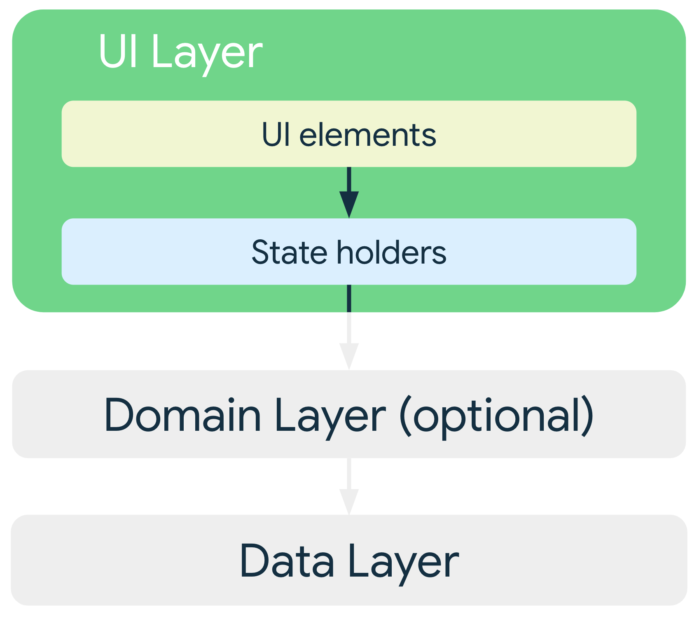

# UI 레이어

- [UI 레이어](#ui-레이어)
  - [UI 레이어 아키텍처](#ui-레이어-아키텍처)
    - [UI 상태 정의](#ui-상태-정의)
      - [불변성](#불변성)
    - [단방향 데이터 흐름으로 상태 관리 (UDF, UnDirectional Data Flow)](#단방향-데이터-흐름으로-상태-관리-udf-undirectional-data-flow)
      - [상태 홀더](#상태-홀더)
      - [로직의 유형](#로직의-유형)
      - [UDF를 사용하는 이유](#udf를-사용하는-이유)
    - [UI 상태 노출](#ui-상태-노출)
      - [추가 고려 사항](#추가-고려-사항)
    - [UI 상태 사용](#ui-상태-사용)
      - [진행 중인 작업 표시](#진행-중인-작업-표시)
      - [화면에 오류 표시](#화면에-오류-표시)
    - [스레딩 및 동시 실행](#스레딩-및-동시-실행)
      - [탐색](#탐색)
      - [Paging](#paging)
      - [애니메이션](#애니메이션)
  - [레퍼런스](#레퍼런스)

---

UI 레이어(프레젠테이션 레이어 라고도 함)의 역할은 화면에 앱 데이터를 표시.
사용자 상호작용(버튼 누르기 등) 또는 외부 입력(네트워크 응답 등)으로 인해 데이터가 변할 때마다 변경사항을 반영하도록 UI가 업데이트 되어야 함.

일반적으로 데이터 레이어에서 가져오는 앱 데이터는 표시해야 하는 정보와 다른 형식임.  
예를 들어 UI용으로 데이터의 일부만 필요하거나 사용자에게 관련성 있는 정보를 표시하기 위해 서로 다른 두 데이터 소스를 병합해야 할 수도 있음. 적용하는 로직과 관계없이 완전히 렌더링 하는 데 필요한 모든 정보를 UI에 전달해야 함. **UI 레이어는 앱 데이터 변경 사항을 UI가 표시할 수 있는 형식으로 변환한 후에 표시하는 파이프 라인임.**



## UI 레이어 아키텍처

UI 라는 용어는 사용하는 API (View 또는 Jetpack Compose)와 관계없이 데이터를 표시하는 활동 및 프래그먼트와 같은 UI 요소를 가리킴. 데이터 레이어의 역할은 앱 데이터를 보유하고 관리하며 앱 데이터에 액세스할 권한을 제공하는 것이므로 UI 레이어에서 다음 단계를 실행해야 함.

1. 앱 데이터를 사용하고 UI에서 쉽게 렌더링 할 수 있는 데이터로 변환
2. UI 렌더링 가능 데이터를 사용하고 사용자에게 표시할 UI 요소로 변환 함
3. 이렇게 조합된 UI 요소의 사용자 입력 이벤트를 사용하고 입력 이벤트의 결과를 필요에 따라 UI 데이터에 반영
4. 1~3 단계를 필요한 만큼 반복

아래 부터는 이러한 단계를 실행하는 UI 레이어를 구현하는 방법임. 아래의 작업과 개념이 있음

- UI 상태 정의 방법
- UI 상태를 생성하고 관리하기 위한 단방향 데이터 흐름(UDF)
- UDF 원칙에 따라 관찰 가능한 데이터 유형인 UI 상태 노출 방법
- 관찰 가능한 UI 상태를 사용하는 UI 구현 방법

### UI 상태 정의

예시로 드는 기능의 목표는 각 기사의 일부 메타데이터와 함께 기사 목록이 표시하는 것. 앱에서 사용자에게 표시하는 정보가 UI 상태.  
사용자가 보는 항목이 UI라면, UI 상태는 앱에서 사용자가 봐야 한다고 지정하는 항목. 동전의 양면과 마찬가지로 UI는 UI 상태를 시각적으로 나타냄. UI 상태가 변경되면 변경사항이 즉시 UI에 반영.

목표를 달성하기 위해 필요한 정보를 다음과 같이 정의된 `NewsUiState` 데이터 클래스에 캡슐화 할 수 있음.

```kotlin
data class NewsUiState(
    val isSignedIn: Boolean = false,
    val isPremium: Boolean = false,
    val newsItems: List<NewsItemUiState> = listOf(),
    val userMessages: List<Message> = listOf()
)

data class NewsItemUiState(
    val title: String,
    val body: String,
    val bookmakred: Boolean = false,
    ...
)
```

#### 불변성

위 예에서 UI 상태 정의는 변경할 수 없음. 불변성의 주요 이점은 변경 불가능한 객체가 순간의 애플리케이션 상태를 보장한다는 점.  
UI는 상태를 읽고 이에 따라 UI 요소를 업데이트 하는 한 가지 역할에 집중 할 수 있음
따라서 UI 자체가 데이터의 유일한 소스인 경우를 제외하고 UI에서 UI 상태를 직접 수정해서는 안됨.  
이 원칙을 위반하면 동일한 정보가 여러 정보 소스에서 비롯되어 데이터 불일치와 미세한 버그가 발생 가능함.

### 단방향 데이터 흐름으로 상태 관리 (UDF, UnDirectional Data Flow)

UI 상태가 UI 렌더링에 필요한 정보가 포함된 변경 불가능한 스냅샷임을 확인함.  
하지만 앱 데이터의 동적 특성에 따라 상태는 시간이 지나면서 변경될 수 있으며 이는 앱을 채우는 데 사용되는 기본 데이터를 수정하는 사용자 상호작용이나 기타 이벤트로 인해 발생하기도 함.  

*중재 요소*가 각 이벤트에 적용할 로직을 정의하고 UI 상태를 만들기 위해 지원 데이터 소스에 필요한 변환을 실행하여 상호작용을 처리한다는 이점이 있음  
상호작용과 이에 따른 로직이 UI 자체에 포함될 수 있지만, UI가 이름에서 알 수 있는 것 이상의 역할(데이터 소유자, 생성자, 변환자 등)을 담당하기 시작하면 빠르게 복잡해 질 수 있음.  
복잡해지면 결과 코드가 뚜렷한 경계 없이 긴밀하게 결합된 혼합체가 되므로 테스트 가능 여부에 영향을 미칠 수 있음.  
궁극적으로 UI에 주는 부담을 줄여야 함. UI 상태가 매우 단순하지 않은 이상 **UI의 역할은 오직 UI 상태를 사용 및 표시하는 것이어야 함**

#### 상태 홀더

UI 상태를 생성하는 역할을 담당하고 생성 작업에 필요한 로직을 포함하는 클래스를 **상태 홀더**라고 함. 상태 홀더의 크기는 하단 앱 바와 같은 단일 위젯부터 전체 홤녀이나 탐색 대상에 이르기까지 관리 대상 UI 요소의 범위에 따라 다양함.

전체 화면이나 탐색 대상의 경우 일반적인 구현은 ViewModel의 인스턴스이지만 앱 요구사항에 따라 간단한 클래스로도 충분할 수 있음.  
예로 뉴스 앱은 `NewsViewModel`클래스를 상태 홀더로 사용하여 섹션에 표시되는 화면의 UI 상태를 생성함.

UI와 상태 생성자 간의 상호 종속을 모델링하는 방법은 다양하지만 UI와 ViewModel 클래스 사이의 상호작용은 대체로 **이벤트 입력**과 입력의 후속 상태인 **출력**으로 간주될 수 있으므로 관계는 아래 다이어그램과 같음.


상태가 아래로 향하고 이벤트는 위로 향하는 패턴을 **단방향 데이터 흐름(UDF)**라고 함. 이 패턴이 앱 아키텍처에 미치는 영향은 아래와 같음.

- ViewModel이 UI에 사용될 상태를 보유하고 노출함. UI 상태는 ViewModel에 의해 변환된 앱 데이터
- UI가 ViewModel에 사용자 이벤트를 알림
- ViewModel이 사용자 작업을 처리하고 상태를 업데이트함
- 업데이트도니 상태가 렌더링할 UI에 다시 제공됨
- 상태 변경을 야기하는 모든 이벤트에 위의 작업이 반복됨

탐색 대상이나 화면의 경우 ViewModel은 Repository 또는 UseCase 클래스와 함께 작동하여 데이터를 가져와 UI 상태로 변환하는 동시에 상태 변경을 야기할 수 있는 이벤트 효과를 통합함.  
앞에서 말한 뉴스 앱에는 기사 목록이 포함되며 각 기사의 제목, 설명, 출처, 작성자 이름, 게시일, 북마크 여부가 표시됨.

사용자의 기사 북마크 요청은 상태 변경을 야기할 수 있는 이벤트의 예시임. 상태 생성자의 경우 UI 상태의 모든 필드를 채우고 UI가 완전히 렌더링되는 데 필요한 이벤트를 처리하기 위해 모든 필수 로직을 정의하는 역할은 ViewModel이 담당함.


#### 로직의 유형

기사 북마크는 앱에 가치를 부여하므로 **비즈니스 로직**의 예시임. 자세한 내용은 *데이터 레이어* 참고. 다음과 같이 정의해야 하는 다양한 로직 유형이 있음.

- **비즈니스 로직** : 앱 데이터에 대한 제품 요구사항의 구현. 비즈니스 로직은 일반적으로 도메인 또는 데이터 레이어에 배치되지만 UI 레이어에는 배치되지 않음.
- **UI 동작 로직** 및 **UI 로직** : 화면에 상태 변경 사항을 표시하는 *방법*. 예로 Android `Resources` 를 사용하여 화면에 표시할 올바른 텍스트를 가져오거나, 사용자가 버튼을 클릭할 때 특정 화면으로 이동하거나, 토스트 메시지, 스낵바를 사용하여 화면에 메시지를 표시하는 것.

특히 `Context` 같은 UI 유형의 경우 UI 로직은 ViewModel이 아닌 UI에 있어야 함.  
테스트 가능성을 높이고 문제 구분에 도움이 되도록 UI 로직을 다른 클래스에 위임하고자 하며 UI 가 점점 복잡해지는 경우 **간단한 클래스를 상태 홀더로 만들 수 있음**.  
UI에서 생성된 간단한 클래스는 UI의 수명 주기를 따르기 때문에 Android SDK 종속 항목을 사용할 수 있음.  
ViewModel 객체의 수명은 더 길다.

#### UDF를 사용하는 이유

UDF는 위의 그림처럼 상태 생성 주기를 모델링함. 또한 상태 변경이 발생하는 위치, 변환되는 위치, 최종적으로 사용되는 위치를 구분함.  
이렇게 구분하면 UI가 이름에 드러난 의미 그대로 동작할 수 있음. 즉, 상태 변경 사항을 관찰하여 정보를 표시하고 변경 사항을 ViewModel에 전달하여 사용자 인텐트를 전달함.

UDF 사용시 다음이 가능하다.

- **데이터 일관성** : UI용 정보 소스가 하나입니다.
- **테스트 가능성** : 상태 소스가 분리되므로 UI와 별개로 테스트 가능함
- **유지 관리성** : 상태 변경은 잘 정의된 패턴을 따름. 즉, 변경은 사용자 이벤트 및 데이터를 가져온 소스 모두의 영향을 받음

### UI 상태 노출

UI 상태를 정의하고 이 상태의 생성을 관리할 방법을 결정한 후에는 생성된 상태를 UI에 표시하는 단계임.  
UDF 를 사용하여 상태 생성을 관리하므로 생성된 상태를 스트림으로 간주할 수 있음. 즉, 시간 경과에 따라 여러 버전의 상태가 생성됨. `LiveData` 또는 `StateFlow` 와 같이 관찰 가능한 데이터 홀더에 UI 상태를 노출해야 함.  
이유는 ViewModel에서 데이터를 직접 가져오지 않고도 UI가 상태 변경 사항에 반응할 수 있도록 하기 위해서임. 이러한 유형은 항상 최신 버전의 UI 상태를 캐시한다는 이점도 있음. 이는 구성 변경 후 빠른 상태 복원에 유용함

UI에 노출되는 데이터가 비교적 간단할 때는 UI 상태 유형으로 데이터를 래핑하는 것이 좋은 경우가 많음. 내보낸 상태 홀더와 관련 화면/UI 요소 간의 관계를 전달하기 때문임. 또한 UI 요소가 더 복잡해질 때 언제나 간편하게 UI 상태 정의를 추가하여 UI 요소를 렌더링하는 데 필요한 더 많은 정보를 포함할 수 있음.

`UiState` 스트림을 만드는 일반적인 방법은 ViewModel에서 지원되는 변경 가능한 스트림을 변경 불가능한 스트림으로 노출하는 것임.

```kotlin
class NewsViewModel(...): ViewModel() {
    private val _uiState = MutableStateFlow(NewsUiState())
    val uiState: StateFlow<NewsUiState> = _uiState.asStateFlow()
    ...
}
```

이 다음 ViewModel은 상태를 내부적으로 변경하는 메서드를 노출하여 UI에 사용되도록 업데이트를 게시함.  
예로 비동기 작업을 실행해야하는 경우 `viewMdelScope`를 사용하여 코루틴을 실행하고 코루틴이 완료되면 변경 가능한 상태를 업데이트 할 수 있음.

```kotlin
class NewsViewModel(
    private val repository: NewsReposiory,
    ...
): ViewModel() {
    private val _uiState = MutableStateFlow(NewsUiState())
    val uiState: StateFlow<NewsUiState> = _uiState.asStateFlow()

    private var fetchJob: Job? = null

    fun fetchArticles(category: String) {
        fetchJob?.cancel()
        fetchJob = viewModelScope.launch {
            try {
                val newsItems = repository.newsItemsForCategroy(category)
                _uiState.update { it.copy(newsItems = newsItems) }
            } catch (ioe: IOException) {
                // 에러 핸들링 및 UI로 알림
                _uiState.update {
                    val message = getMessagesFromThrowable(ioe)
                    it.copy(userMessages = message)
                }
            }
        }
    }
}
```

위의 예에서 `NewsViewModel` 클래스는 특정 카테고리의 기사를 가져오라고 시도한 후에 결과에 따라 UI가 적절하게 반응할 수 있도록 시도의 성공 또는 실패 결과를 UI 상태에 반영함.

#### 추가 고려 사항

UI 상태를 노출할 때 다음 사항을 고려해 볼 것

**UI 상태 객체는 서로 관련성 있는 상태를 처리해야 함**  
이렇게 하면 불일치가 줄어들고 코드를 이해하기가 더 쉬움. 뉴스 항목 목록과 북마크 수를 서로 다른 두 스트림에 노출하면 한 스트림이 업데이트 되고 다른 스트림은 업데이트 되지 않은 상황이 발생 가능함.  
단일 스틀미을 사용하면 두 요소가 모두 최신 상태로 유지됨. 또한 일부 비즈니스 롲기에는 소스 조합이 필요할 수 있음. 예를 들어 로그인한 상태인 동시에 프리미엄 뉴스 서비스의 구독자인 사용자에게만 북마크 버튼을 표시해야 한다면 다음과 같이 UI 상태 클래스를 정의하면 됨  

```kotlin
data class NewsUiState(
    val isSignedIn: Boolean = false,
    val isPremium: Boolean = false,
    val newsItems: List<NewsItemUiState> = listOf()
)

val NewsUiState.canBookmarkNews: Boolean get() = isSignedIn && isPremium
```  

이 선언에서 북마크 버튼의 표시 여부는 다른 두 속성의 파생 속성임. 비즈니스 로직이 더 복잡해짐에 따라 모든 속성을 즉시 사용할 수 있는 단일 `UiState` 클래스의 중요성이 점차 커짐

**UI 상태 : 단일 스트림인지 여러 스트림인지**  
UI 상태 노출 대상을 단일 스트림과 여러 스트림 중에서 선택할 때 주요 원칙은 이전 글머리 기호에서 설명한 내보낸 항목 간의 관계임.  
단일 스트림 노출의 가장 큰 장점은 편의성과 데이터 일관성임. 즉, 상태 사용자가 언제나 즉시 최신 정보를 확인할 수 있음. 하지만 다음과 같이 ViewModel 상태의  스트림이 별개일 때 적합한 경우가 있음.

- 관련 없는 데이터 유형 : UI를 렌더링하는 데 필요한 일부 상태는 서로 완전히 별개일 수 있음. 이때 서로 다른 상태를 함께 번들로 묶는 데 드는 비용이 이점보다 더 클 수 있으며 이는 상태 중 하나가 다른 상태보다 더 자주 업데이트 되는 경우에 특히 드러남
- `UiState` 비교(diff) : `UiState` 객체에 필드가 많을수록 필드 중 하나를 업데이트 하면 스트림이 내보내질 가능성이 커짐. 뷰에는 연속적으로 이루어지는 내보내기가 같은지 다른지 파악하는 비교(diff) 메커니즘이 없으므로 내보내기할 때마다 뷰가 업데이트됨. 따라서 `Flow` API 또는 `LiveData`의 `distinctUntilChanged()`와 같은 메서드를 사용한 완화 작업이 필요할 수 있음.
  
### UI 상태 사용

UI에서 `UiState` 객체의 스트림을 사용하려면 사용 중인 관찰 가능한 데이터 유형에 터미널 연산자를 사용함.  
예로 `LiveData` 의 경우 `observe()` 메서드를 사용하고 `Flow` 의 경우 `collect()` 메서드나 이 메서드의 변형을 사용함

UI에서 관찰 가능한 데이터 홀더를 사용할 때는 UI 수명 주기를 고려해야 함.  
수명 주기를 고려해야하는 이유는 사용자에게 뷰가 표시되지 않을 때 UI가 UI 상태를 관찰해서는 안 되기 때문임.  
`LiveData` 를 사용하면 `LifecycleOwner` 가 수명 주기 문제를 암시적으로 처리함. `Flow` 를 사용할 때는 적절한 코루틴 범위와 `repeatOnLifecycle` API 로 처리하는 것이 가장 좋음

#### 진행 중인 작업 표시

`UiState` 클래스의 로드 상태를 나타내는 간단한 방법은 Boolean 필드를 사용하는 것

```kotlin
data class NewsUiState(
    val isFetchingArticles: Boolean = false,
    ...
)
```

이 플래그의 값은 UI에 진행률 표시줄이 존재하는지를 나타냄

```kotlin
class NewsActivtiy: AppCompatActivity() {
    private val viewModel: NewsViewModel by viewModels()

    override fun onCreate(savedInstanceState: Bundle?) {
        ...
        lifecycleScope.launch {
            repeatOnLifecycle(Lifecycle.State.STARTED) {
                // ProgressBar 가시성과 isFetchingArticles 플래그 바인딩
                viewModel.uiState
                    .map { it.isFetchingArticles }
                    .distinctUntilChanged()
                    .collect { progressBar.isVisible = it }
            }
        }
    }
}
```

#### 화면에 오류 표시

UI에서의 오류 표시는 진행 중인 작업 표시와 비슷함. 두 작업은 모두 존재 여부를 나타내는 Boolean 값으로 쉽게 표현되기 때문임.  
하지만 오류에는 사용자에게 다시 전달하는 관련 메시지 또는 실패한 작업을 다시 시도하는 관련 작업이 포함될 수 있음. 따라서 진행 중인 작업을 로드하고 있거나 로드하고 있지 않은 동안 오류 컨텍스트에 적절한 메타데이터를 호스팅하는 데이터 클래스를 사용하여 오류 상태를 모델링해야 할 수 있음.

예시로 작업에서 오류가 발생하는 경우 오류 상황을 자세히 설명하는 메시지를 하나 이상 사용자에게 표시하는 것이 좋음.

```kotlin
data class Message(val id: Long, val message: String)

data class NewsUiState(
    val userMessages: List<Message> = listOf(),
    ...
)
```

오류 메시지는 스낵바 같은 UI 요소의 형식으로 사용자에게 표시될 수 있음. 이러한 기능은 **UI 이벤트**의 생성 및 사용 방식과 관련이 있음.

### 스레딩 및 동시 실행

ViewModel에서 실행되는 모든 작업은 기본 스레드에서 안전하게 호출된다는 *기본 안전성*을 갖추어야 함.  
데이터 레이어와 도메인 레이어가 작업을 다른 스레드로 옮기는 역할을 담당하기 때문임.

또한 장기 실행 작업의 경우 ViewModel에서 로직을 백그라운드 스레드로 옮기는 역할을 담당함. 코루틴은 동시 실행 작업을 관리하는 좋은 방법, Jetpack 아키텍처 구성요소는 코루틴을 기본적으로 지원함.

참고 : [Android의 Kotlin](https://developer.android.com/kotlin/coroutines?hl=ko)

#### 탐색

앱 탐색의 변경사항은 주로 이벤트 같은 내보내기에 의해 이루어짐.  
예시로 `SignInViewModel` 클래스가 로그인을 실행하면 `UiState` 는 `isSignedIn` 필드를 `true` 로 설정할 수 있음. 이러한 트리거는 위의 **UI 상태 사용** 섹션에 설명된 대로 사용해야 함. 단 사용 구현이 **탐색 구성요소**를 지원해야 함.

참고 : [탐색 Navigation](https://developer.android.com/guide/navigation?hl=ko)

#### Paging

Paging 라이브러리는 UI에서 `PagingData` 유형과 함께 사용 됨. `PagingData` 는 시간 경과에 따라 변경될 수 있는 항목을 나타내고 포함하므로 변경 불가능한 UI 상태로 표현되어서는 안됨.  
대신 ViewModel의 데이터를 독립적으로 자체 스트림에서 노출해야 함.

#### 애니메이션

부드럽고 원활한 최상위 탐색 전환을 제공하기 위해 다음 화면의 데이터가 로드 될 때 까지 기다린 후에 애니메이션을 시작하는 것이 좋음.  
Android 뷰 프레임워크는 `postponeEnterTransition()` 및 `startPostponedEnterTransition()` API를 사용하여 프래그먼트 대상 간의 전환을 지연하는 후크를 제공함.  
이러한 API는 다음 화면의 UI 요소(일반적으로 네트워크에서 가져온 이미지)가 표시될 준비가 되면 UI가 다음 홤녀으로의 전환을 애니메이션 처리할 수 있도록 함.

참고 : [Android 모션 샘플](https://github.com/android/animation-samples/tree/main/Motion)

---

> 안드로이드 앱 아키텍처의 UI 레이어에 대한 사항을 알아보았다. UI 레이어에는 어떠한 정보가 담겨있고 어떠한 의미를 가지고 있는 것을 배우게됐다. 각 요소(UI 이벤트, 상태 홀더 및 UI 상태와 생성)에 대한 자세한 설명은 다음 파트에서 이루어진다.
>
> UI 레이어에서 가장 중요한 사항은 상태 또는 화면 요소에 대한 로직만 담아야 한다는 것이다. 이전 까지는 많은 로직을 UI 레이어에 담다 보니 코드 가독성이 떨어지는 문제가 있었다. 내가 만든 코드인데도 한참 보다가 머릿속에서 기억을 꺼내야 했다. 요람 앱을 배포하고 나서는 이전의 기능들을 이 UI 레이어 원칙에 맞추고 Flow 로 리팩토링 해야 겠다. 그러고 나서는 테스트도 해야겠다. 원칙을 지키는 이유중 중요한 하나는 테스트 가능성이니 말이다.

## 레퍼런스

[안드로이드 앱 아키텍처 가이드/UI 레이어/UI레이어 정보](https://developer.android.com/topic/architecture/ui-layer?hl=ko)
