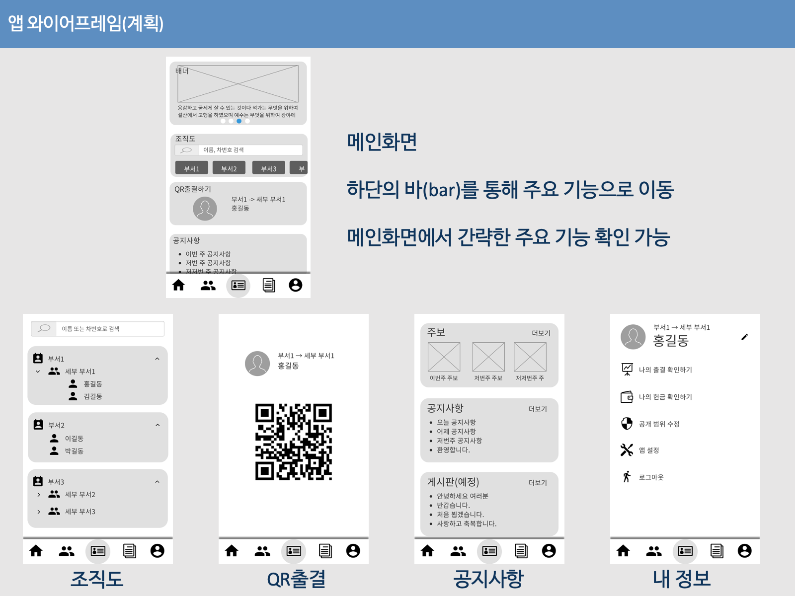

# 계획 단계 회고록

## Fact

- 개인 역량 향상과 교회의 제의로 인해 스마트 요람 어플 계획
- 어플 기능으로 조직도, 게시판, 내 정보 계획
- 유사 앱 밴치마킹
- 간단한 교적 관리, 내 정보 수정, 내 정보 공개 관리 기능 추가 계획
- 향후 기능 추가

## Feeling

- 스마트 요람 어플의 기능을 생각한다면 커뮤니티와 인사 관리 정도 되는 어플을 만들 수 있기에 내게 큰 성장이 될거라 생각 했다.
- 시중에 나와있는 유사 앱을 밴치마킹 하며 계획해보니 메인 기능의 자잘한 기능까지 구현이 필요하다 보니 기획이 커져버린 것 같다.
- 먼저 내가 구현할 수 있는 영역인지 부터 검증이 필요한 것 같다. 기능을 구현하기 위해 필요한 기술 및 라이브러리 등을 미리 사용해보고 결정해야겠다.
- 역량 향상의 목적이라면 기업이 원하는 기술 스택의 역량을 올리는 것이 좋을 것 같다.

## Finding

- 계획된 기능의 효율적인 화면 구성으로 하단의 네비게이션 바를 통한 구조로 한다.  

- 역량 향상을 위해 Kotlin 100%로 구현한다.
- MVVM 패턴을 사용하여 설계한다.  
MVVM 패턴을 사용하기 위해서는 데이터 바인딩이 필요하다.  
데이터 바인딩을 하기 위해선 ObservableField나 LiveData를 사용하면 된다.
- ObservableField vs LiveData 를 따지자면 LiveData가 압승이다.
- 서버와 통신하기 위한 방법으로 Volley나 okHttp나 okHttp를 통해 만든 Retrofit 라이브러리를 이용하면 된다.
- 비동기 작업을 위해서는 ReactiveX나 Coroutine을 이용하면 된다.  
ReactiveX 는 러닝커브가 처음이 어렵다.

## Future Action

- Kotlin 100%로 앱 개발
- MVVM 패턴을 사용하여 설계
- MVVM 패턴을 이용하기 위해 데이터 바인딩과 LiveData를 사용
- 서버 통신 라이브러리로 Retrofit2 라이브러리 사용
- Kotlin의 Coroutine 사용
- 그 외 여러 Jetpack 라이브러리 사용

## Feedback

- 1인 개발에 비해 계획이 너무 크다.  
기획한 기능을 구현하다 보니 자잘하게 구현해야 할 부분들이 많다.
- 계획 단계 부터 이렇게 회고록을 작성했어야 했다.  
본 회고록은 계획하고 약 1년 반이 지나고 작성됐다.

---
