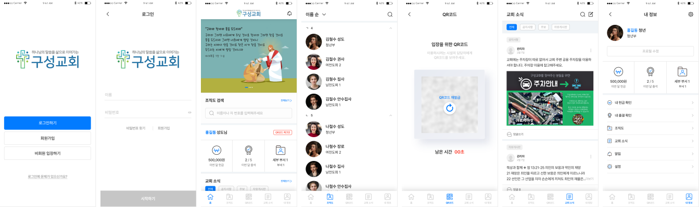

# 개발 초기(~21.06.) 단계 회고록

## Fact

- 기능 구현을 최우선으로 작업함
- FragmentManager 를 이용한 화면 전환 구현
- 조직도 목록 Recycler-Recycler 형태로 구현
- 스플래시 화면 구현
- 홈 화면 배너, 조직도, 내 정보 대시보드 구현
- 조직도 유저 검색창 구현
- 조직도 이름 순 정렬 구현
- 조직도 유저 이름 검색 구현
- 계정 생성/로그인 구현
- 계정 자동 로그인 구현
- 프로필 사진 구현
- 교인증 구현
- 출결 기능 구현

## Feeling

- 기능 구현을 최우선으로 잡다보니 UI/UX 는 많이 허술하다.  
하지만 차후에 디자니어와의 협업으로 손볼테니 괜찮다고 생각했다.

- FragmentManager 를 이용하여 화면 전환은 Boiler-plate 코드가 너무 많은 것 같다.  
화면을 전환할 때 마다 동일한 코드를 작성하니 가독성으로도 떨어진다. Jetpack 라이브러리 중 Navigation component가 있는데 한번 살펴봐야 겠다.

- 배너 및 프로필 사진을 ImageView 에 적용하기 위한 이미지 로더 라이브러리로 Coil을 사용했다.  
Coil 이외에도 glide와 Picasso 가 있었지만 Coil로 선택한 이유로  
Kotlin과 Coroutine 베이스로 만들어져있고 최소한의 Boiler-plate 를 사용하게 해주며
다른 라이브러리에 비해 가볍다고 해서 적용하게 됐다.

- 조직도 목록 구현이 난이도가 있었다.  
조직도 구조가 트리 구조이고 클릭하는 상호작용을 통해 접히거나 펼칠 수 있게 만들어야 했다.  
그래서 Recycler 안에 Recycler가 있는 중첩되는 구조로 택했다. 이 구조는 까딱하면 의도치 않게 작동하는 문제가 생긴다. 차후에 다른 대안을 생각해 보아야 겠다.

- LiveData 또는 Coroutine 등 처음 사용해보는 기술들이 너무 많다.  
아직 완벽하게 이해하고 활용한다고 보기 힘들다.  
미숙하더라도 계속 활용해 본다면 분명히 활용도가 커지고 능숙해 질거라 믿어 의심치 않는다.

- 교인증을 위해 QR코드에 대해서도 알아봤다.  
QR코드를 안드로이드에서 사용하기 위해 zxing 라이브러리가 있지만 빠른 프로젝트 진행을 위해 레이아웃과 커스텀 기능까지 제공하는 오픈 소스 라이브러리를 사용했다.
QR코드를 안드로이드에서 사용하기 위해서 AwesomeQRCode 라이브러리를 사용했다.  
차후에 zxing 라이브러리만을 이용하여 요람 프로젝트만의 모듈을 만들어야 겠다.

- 기능은 어느 정도 구현했으니 새로운 UI 를 적용하려고 한다.  
디자이너에게 아래와 같은 디자인을 받았다.  
  
UI 변경에 따른 UX 도 새롭게 만들어야 될테고 그에 맞는 View 도 만들어 줘야 할거다. 재밌어 보인다.

## Finding

- LiveData 를 적용시키면서 Backing Property 라는 것을 처음 알게 됐다.  
OOP 언어의 요소중 하나의 캡슐화를 위해 존재 하는 개념이다.
이를 더 알아보기 위해 Kotlin의 Backing field, private set, setter, getter 에 대해 더 알게 됐다.

- Navigation component 에 대해서 알아보고 있다.  
이를 사용하면 간결한 코드 사용과 안드로이드 스튜디오 UI로 Fragment 진행 방향을 지정하거나 볼 수도 있다. 차후 마이그레이션을 진행해야겠다.

- 이름 정렬과 검색을 위해 한글 초성 분리 알고리즘을 찾아보고 적용했다. 유니코드에서 한글의 시작은 `가`이고 값은 0xAC00 이라는 거다. 이는 Kotlin이나 Java 뿐 아니라 다른 언어에서도 활용할 수 있을 것이다.
  
- Coroutine을 활용하여 교인증 유효시간 카운트를 만들었다. 이 외에도 서버와의 통신 등에서도 활용하여 Coroutine에 대해 활용성과 능숙도를 올리고 있다.

## Future Action

- Navigation Component로 마이그레이션
- 조직도 목록 보완
- 새로운 디자인 적용

## Feedback

- 기능 구현을 할 때 작동하는지에만 초점을 맞춰서 진행을 했다.  
뭐가 더 효율적인 코드인지, 코드 컨벤션이나 MVVM 디자인 패턴에 맞춘 구조라던가 신경을 쓰지 못했다. 이를 보완해야 할 필요성이 있다.
